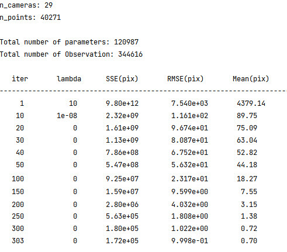
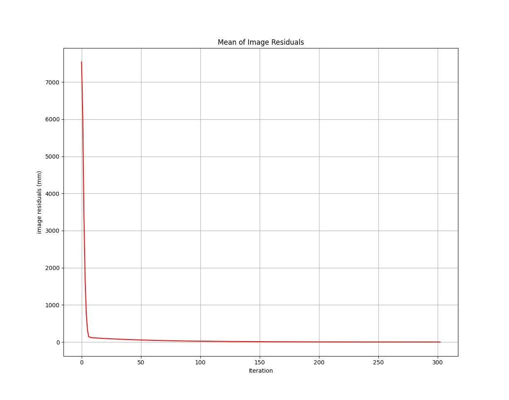

# Sparse-Bundle-Adjustments-with-GCPs


This python implementation of Sparse bundle adjustment based on the sparse Levenberg-Marquardt algorithm with Ground Control Points (GCPs). A bundle adjusmtent problem arises in 3-D reconstruction and it can be formulated as follows (taken from https://en.wikipedia.org/wiki/Bundle_adjustment):

To derive accurate 3D geospatial information from imagery, it is necessary to establish the camera's interior and exterior orientation parameters. Interior orientation parameters (IOPs), which contain the internal sensor elements such as principal distance, principal point coordinates, and lens distortions, are specified through a camera calibration procedure. EOPs, which define the position and orientation of the camera at the point of exposure in a mapping frame, can be established using either Ground Control Points (GCPs) through a Aerial triangulation (AT) process. AT is one of the most critical steps in aerial photogrammetry to estimate the Tie points Object coordinates (OC), EOPs, and  IOP which is performed with the bundle Adjustment (BA).

The basic photogrammetric principal geometry consists of three geometric entities: object space points (3D points), corresponding image points (2D points), and perspective centers. Such a geometry can be formulized with collinearity equations. 

 $R_{ij} (i = 1,2,3,... , j = 1,2,3,...)$ stands for the nine elements of the rotation matrix , which can be modeled by three rotation Euler angles $\omega\$,
 $\varphi\$ and $\kappa\$. 
 
$$R =\begin{bmatrix}
    r_{11} & r_{12} & r_{13}     \\
    r_{21} & r_{22} & r_{23}     \\
    r_{31} & r_{32} & r_{33}
\end{bmatrix}$$

$$\begin{bmatrix}
    P  \\
    S  \\
    Q
\end{bmatrix}
= R .\begin{pmatrix}\begin{bmatrix}
    x   \\
    Y   \\
    Z
\end{bmatrix} - \begin{bmatrix}
    X_{0}     \\
    Y_{0}     \\
    Z_{0}
\end{bmatrix}
\end{pmatrix}$$
 
$X_{0},Y_{0}$ and $Z_{0}$ are the translation parameters for the camera station. Meanwhile, $X,Y$ and $Z$ are are the object point coordinates usually given in meters in the mapping reference system (i.e., Earth-fixed coordinate system, in the case UTM)

The additional parameters related to lens distortions, coordinates of the principal point (i.e., the point closest to the projection center), and sensor distortions can, in practice, be used to recover the theoretical collinearity condition between image points, camera position, and object point.

To estimate the 6 EOPs, the image coordinates are first rectifed using the calculated IOPs of the digital camera, consisting of the principal point $(c_{x},c_{x})$ (in pixel), the focal length $f$ (in pixel), the coefcients of radial distortion $\(K_{1},K_{2},K_{3})\$ (in pixel) and the coefcients of decentring distortion $\(P1,P2)\$ (pixel) and affinity and non-orthogonality (skew) coefficients $(B1, B2)$ (in pixels).  According to equations, the image measurements $(u, v)$ (pixel) are rectifed to $(u', v')$ (pixel) according to

 
$x = - \frac{P}{Q}$

$y = \frac{S}{Q}$

$r= \sqrt{x^2+y^2}$

$x' = x(K_{1}r^2 + K_{2}r^4 + K_{3}r^6) + (P_{1}(r^2+2x^2) + 2P_{2}xy)$

$y' = y(K_{1}r^2 + K_{2}r^4 + K_{3}r^6) + (P_{2}(r^2+2y^2) + 2P_{1}xy)$

$u' = 0.5w + c_{x} + x'f + x'B1 + y'B2$

$v' = 0.5h + c_{y} + y'f$

 $f_{x} = u - u'$ 
 
 $f_{y} = v - v'$


Finally, the camera parameters and coordinates of Tie points and are updated. In this research, the Sparse Bundle Adjustment (SBA) method was used Reduced Camera System, and Schur Complement. Because the number of equations of observations and the number of unknowns is high. As a result, the dimensions of matrix A are so large that they cannot be solved in the usual way.
It can prove that the schur complement of a symmetric positive definite matrix is symmetric positive definite, thus can be solved by Cholesky decomposition. (taken from https://en.wikipedia.org/wiki/Schur_complement)


## setup
Requires Python and the installation of following packages

- numpy
- pandas
- scipy
- matplotlib
- ismember
- xmltodict

## Installation using pip
If using pip as your package manager you only need to type the following...


``` math
    pip install -r requirements
```


## Files
- Lib : inclode Objective function, Jacobians and functions that read initial IOPs, EOPs and etc.
- Sparse_BA : inclode main code that implementation BA

Its not package, easy to use, just update data folder and run Sparse_BA.py.


## Results






