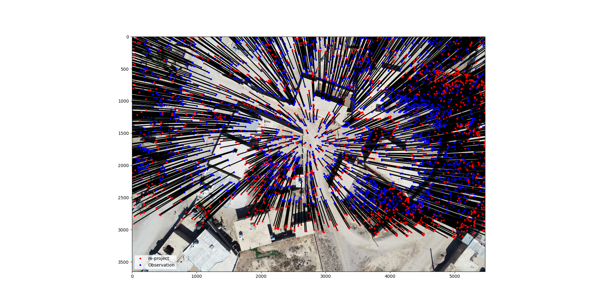

# Sparse-Bundle-Adjustments-with-GCPs


This python implementation of Sparse bundle adjustment is based on the sparse Levenberg-Marquardt algorithm with Ground Control Points (GCPs). A bundle adjustment problem arises in 3-D reconstruction, and it can be formulated as follows (taken from https://en.wikipedia.org/wiki/Bundle_adjustment):

To derive accurate 3D geospatial information from imagery, it is necessary to establish the camera's interior and exterior orientation parameters. , which contain internal sensor elements such as principal distance, principal point coordinates, and lens distortions, are specified through a camera calibration procedure. EOPs, which define the position and orientation of the camera at the point of exposure in a mapping frame, can be established using either Ground Control Points (GCPs) or through an Aerial triangulation (AT) process. AT is one of the most critical steps in aerial photogrammetry to estimate the Tie points Object coordinates (OC) and EO


if you want compute Interior orientation parameters (IOP) of Cameras, should use (SBA-with-CameraCalibration) repository as follows (https://github.com/naiem-reza/SBA-with-CameraCalibration)

## setup
Requires Python and the installation of following packages

- numpy
- pandas
- scipy
- matplotlib
- ismember
- xmltodict

## Installation using pip
If using pip as your package manager, you only need to type the following...

```
pip install -r requirements
```


## Files
- Func : inclode Objective function, Jacobians and functions that read initial IOPs, EOPs and etc.
- SBA : inclode main code that implementation BA

It is not a package, but it is easy to use; update the data folder and run SBA.py.

## Results
- Iteration of Algorithm (Up), Iteration of image and object coordinate residuals and the posteriori sigma zero (Phi) (down)  


- Show Rsiduals of first iteration (Up), Normal and t-student distribution on histogram of all residuals (down)



- Show Rsiduals of Last iteration (Up), Normal and t-student distribution on histogram of all residuals (down)


